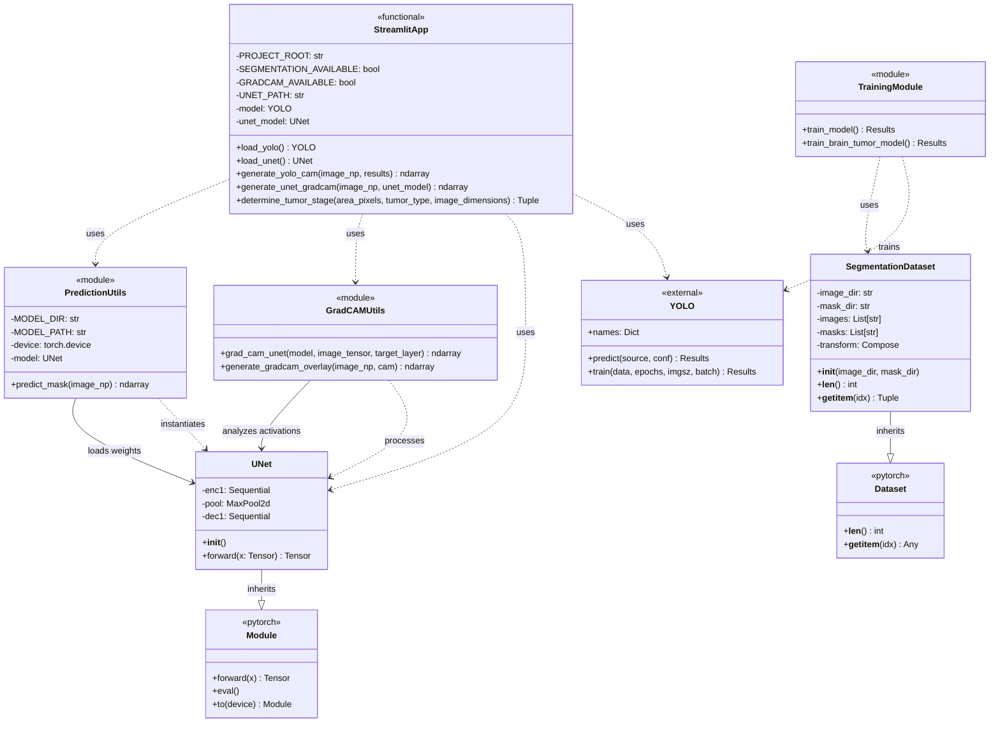

# Brain Tumor Detection System - Class Diagram

## Overview
This document provides a comprehensive class diagram for the Brain Tumor Detection System, showing all classes, their attributes, methods, and relationships.

---

## Class Diagram (Mermaid Syntax)



---

## Detailed Component Description

### 1. **UNet** (Neural Network Model)
**File:** `model/segmentation/unet_model.py`

**Type:** PyTorch Neural Network Class

**Purpose:** Performs semantic segmentation to identify precise tumor boundaries.

**Attributes:**
- `enc1`: Encoder layer (Conv2d + ReLU)
- `pool`: Max pooling layer
- `dec1`: Decoder layer (Conv2d + Sigmoid)

**Methods:**
- `__init__()`: Initializes network layers
- `forward(x)`: Forward pass through the network

**Inheritance:** `torch.nn.Module`

---

### 2. **SegmentationDataset** (Data Handler)
**File:** `model/segmentation/dataset.py`

**Type:** PyTorch Dataset Class

**Purpose:** Loads and preprocesses images and masks for training.

**Attributes:**
- `image_dir`: Path to image directory
- `mask_dir`: Path to mask directory
- `images`: List of image filenames
- `masks`: List of mask filenames
- `transform`: Transformation pipeline (Resize + ToTensor)

**Methods:**
- `__init__(image_dir, mask_dir)`: Initialize dataset paths
- `__len__()`: Returns number of samples
- `__getitem__(idx)`: Returns image-mask pair at index

**Inheritance:** `torch.utils.data.Dataset`

---

### 3. **YOLO** (External - Object Detection)
**Source:** Ultralytics YOLOv8

**Type:** External Class

**Purpose:** Detects tumors and classifies them into types.

**Key Attributes:**
- `names`: Dictionary mapping class IDs to names (glioma, meningioma, pituitary, no_tumor)

**Key Methods:**
- `predict(source, conf)`: Run inference on images
- `train(data, epochs, imgsz, batch)`: Train the model

**Used By:** StreamlitApp, TrainingModule

---

### 4. **StreamlitApp** (Main Application)
**File:** `app/app.py`

**Type:** Functional Module (not a class)

**Purpose:** Web-based user interface for tumor analysis.

**Global Variables:**
- `PROJECT_ROOT`: Application root directory
- `SEGMENTATION_AVAILABLE`: Flag for U-Net availability
- `GRADCAM_AVAILABLE`: Flag for Grad-CAM availability
- `UNET_PATH`: Path to U-Net model weights
- `model`: Loaded YOLO model instance
- `unet_model`: Loaded U-Net model instance

**Functions:**

**Model Loaders:**
- `load_yolo() -> YOLO`: Loads pre-trained YOLO model
- `load_unet() -> UNet`: Loads pre-trained U-Net model

**Visualization Functions:**
- `generate_yolo_cam(image_np, results) -> ndarray`: Creates heatmap from YOLO detections
- `generate_unet_gradcam(image_np, unet_model) -> ndarray`: Generates Grad-CAM visualization

**Analysis Functions:**
- `determine_tumor_stage(area_pixels, tumor_type, image_dimensions) -> Tuple[str, str, str]`: Determines tumor stage based on size and coverage

**Returns:** (stage_name, color_code, description)

---

### 5. **GradCAMUtils** (Visualization Module)
**File:** `model/segmentation/grad_cam_unet.py`

**Type:** Functional Module

**Purpose:** Generates Grad-CAM (Gradient-weighted Class Activation Mapping) visualizations.

**Functions:**

**`grad_cam_unet(model, image_tensor, target_layer='enc1') -> ndarray`**
- Generates attention heatmap showing which regions the model focuses on
- Uses forward and backward hooks to capture gradients
- Parameters:
  - `model`: UNet model instance
  - `image_tensor`: Input image tensor
  - `target_layer`: Layer to visualize (default: 'enc1')
- Returns: CAM heatmap as numpy array

**`generate_gradcam_overlay(image_np, cam) -> ndarray`**
- Overlays Grad-CAM heatmap on original image
- Parameters:
  - `image_np`: Original image (H, W, 3)
  - `cam`: Grad-CAM heatmap (H, W)
- Returns: Image with overlay

---

### 6. **PredictionUtils** (Inference Module)
**File:** `model/segmentation/predict_unet.py`

**Type:** Functional Module

**Purpose:** Handles U-Net model inference for segmentation.

**Global Variables:**
- `MODEL_DIR`: Directory containing model weights
- `MODEL_PATH`: Full path to model file
- `device`: PyTorch device (CPU/GPU)
- `model`: Pre-loaded UNet instance

**Functions:**

**`predict_mask(image_np) -> ndarray`**
- Generates segmentation mask for input image
- Steps:
  1. Resizes image to 256x256
  2. Normalizes pixel values
  3. Runs through U-Net model
  4. Thresholds output (>0.5)
  5. Resizes back to original size
- Parameters:
  - `image_np`: Input image as numpy array
- Returns: Binary mask (0 or 255)

---

### 7. **TrainingModule** (Model Training)
**Files:** `train.py`, `model/train_yolo.py`

**Type:** Functional Module

**Purpose:** Trains YOLO and U-Net models.

**Functions:**

**`train_model() -> Results`**
- Trains YOLOv8 model on brain tumor dataset
- Configuration:
  - Base model: yolov8n.pt
  - Epochs: 10 (configurable)
  - Image size: 640x640
  - Batch size: 8
- Returns: Training results

**`train_brain_tumor_model() -> Results`**
- Alternative training function
- Configuration:
  - Epochs: 50
  - Batch size: 16

---

## Component Interactions

### Detection Pipeline
```
Image Input
    ↓
YOLO Model
    ↓
Bounding Boxes + Classifications
    ↓
Tumor Stage Determination
    ↓
Results Display
```

### Segmentation Pipeline
```
Image Input
    ↓
U-Net Model
    ↓
Segmentation Mask
    ↓
Overlay on Original
    ↓
Visual Output
```

### Grad-CAM Pipeline
```
Image Input + U-Net Model
    ↓
Forward Pass (capture features)
    ↓
Backward Pass (capture gradients)
    ↓
Weight Calculation
    ↓
CAM Generation
    ↓
Heatmap Overlay
```

---

## Class Relationships Summary

### Inheritance Relationships
1. **UNet** extends `torch.nn.Module`
2. **SegmentationDataset** extends `torch.utils.data.Dataset`

### Dependency Relationships
1. **StreamlitApp** uses:
   - YOLO (for detection)
   - UNet (for segmentation)
   - GradCAMUtils (for visualization)
   - PredictionUtils (for inference)

2. **GradCAMUtils** processes:
   - UNet models

3. **PredictionUtils** instantiates and uses:
   - UNet models

4. **TrainingModule** trains:
   - YOLO models
   - Uses SegmentationDataset

### Composition Relationships
1. **UNet** contains:
   - Sequential layers (enc1, dec1)
   - MaxPool2d layer

2. **SegmentationDataset** contains:
   - Transform pipeline
   - File lists

---

## Architectural Pattern

**Pattern:** Modular Architecture with Separation of Concerns

**Layers:**
1. **Presentation Layer:** Streamlit UI (app.py)
2. **Business Logic Layer:** Staging algorithm, visualization generators
3. **Model Layer:** UNet, YOLO (neural networks)
4. **Data Layer:** SegmentationDataset, file I/O
5. **Utility Layer:** Grad-CAM, prediction utilities

**Design Principles Applied:**
- **Single Responsibility:** Each module has one clear purpose
- **Dependency Injection:** Models loaded and passed as parameters
- **Separation of Concerns:** UI, logic, and models are separated
- **Modularity:** Components can be used independently

---

## External Dependencies

### PyTorch Framework
- `torch.nn.Module`: Base class for neural networks
- `torch.utils.data.Dataset`: Base class for datasets
- `torch.device`: Device management (CPU/GPU)

### Ultralytics YOLO
- `YOLO`: Object detection model
- Pre-trained weights: yolov8n.pt

### Streamlit
- Web application framework
- Caching decorators (@st.cache_resource)

### OpenCV & NumPy
- Image processing utilities
- Array operations

---

## Data Flow Diagram

```
┌─────────────────┐
│   User Input    │
│   (MRI Scan)    │
└────────┬────────┘
         │
         ├──────────────┬──────────────┬──────────────┐
         ↓              ↓              ↓              ↓
    ┌────────┐    ┌────────┐    ┌────────┐    ┌────────┐
    │  YOLO  │    │  UNet  │    │GradCAM │    │Staging │
    │Detection│   │Segment.│    │Visual. │    │Logic   │
    └────┬───┘    └────┬───┘    └────┬───┘    └────┬───┘
         │            │             │             │
         └────────┬───┴─────────────┴─────────────┘
                  ↓
         ┌────────────────┐
         │ Streamlit UI   │
         │ (3 tabs +      │
         │  analysis      │
         │  report)       │
         └────────────────┘
```

---

## File Structure Overview

```
Brain_tumor_detection/
├── app/
│   └── app.py                    # StreamlitApp (main UI)
├── model/
│   ├── train_yolo.py            # TrainingModule (YOLO)
│   ├── detect_yolo.py           # Detection utilities
│   └── segmentation/
│       ├── unet_model.py        # UNet class
│       ├── predict_unet.py      # PredictionUtils
│       ├── grad_cam_unet.py     # GradCAMUtils
│       ├── dataset.py           # SegmentationDataset class
│       └── train_unet.py        # U-Net training
├── train.py                     # Main training script
└── test_system.py              # Testing utilities
```

---

## Key Design Decisions

### 1. Functional vs Object-Oriented
- **Main App:** Functional approach for simplicity
- **Models:** Object-oriented (required by PyTorch)
- **Utilities:** Functional for reusability

### 2. Modular Design
- Each component can be tested independently
- Easy to swap out models or add new features
- Clear separation between UI and logic

### 3. Caching Strategy
- Model loading cached with `@st.cache_resource`
- Prevents reloading on every interaction
- Improves performance significantly

### 4. Error Handling
- Graceful degradation (segmentation/Grad-CAM optional)
- Feature flags (SEGMENTATION_AVAILABLE, GRADCAM_AVAILABLE)
- Fallback mechanisms (YOLO-based CAM if U-Net unavailable)

---

## Usage Example

### Detection + Segmentation + Visualization Workflow

```python
# 1. Load models
yolo_model = load_yolo()
unet_model = load_unet()

# 2. Run detection
results = yolo_model.predict(image, conf=0.4)

# 3. Generate segmentation
mask = predict_mask(image)

# 4. Create visualizations
yolo_cam = generate_yolo_cam(image, results)
unet_cam = generate_unet_gradcam(image, unet_model)

# 5. Determine stage
stage, color, desc = determine_tumor_stage(area, type, dimensions)

# 6. Display in Streamlit UI
```

---

## Testing Architecture

**Test File:** `test_system.py`

**Test Coverage:**
1. Import verification
2. Model loading
3. Detection functionality
4. Segmentation functionality
5. Grad-CAM generation
6. Staging algorithm

**Test Pattern:** Functional testing with assertions

---

## Future Extensibility

### Easy Extensions:
1. **New Model Types:** Add new classes inheriting from nn.Module
2. **New Visualizations:** Add functions to GradCAMUtils
3. **Enhanced Staging:** Modify determine_tumor_stage() logic
4. **Additional Features:** Add new tabs/components to StreamlitApp

### Recommended Additions:
1. **ReportGenerator** class: Generate PDF reports
2. **DatabaseManager** class: Store patient data
3. **ImagePreprocessor** class: Standardize preprocessing
4. **ModelEvaluator** class: Metrics and validation

---

## Version Information

- **Project:** Brain Tumor Detection System
- **Architecture:** Modular with PyTorch backend
- **UI Framework:** Streamlit
- **Models:** YOLOv8 (detection), U-Net (segmentation)
- **Visualization:** Grad-CAM

---

## Summary

This class diagram represents a well-structured medical imaging application with:
- **2 main classes** (UNet, SegmentationDataset)
- **1 external class** (YOLO from Ultralytics)
- **4 functional modules** (StreamlitApp, GradCAMUtils, PredictionUtils, TrainingModule)
- **Clear separation** between UI, logic, and models
- **Modular design** allowing independent testing and development
- **Production-ready** architecture with error handling and caching

The system successfully combines object detection, semantic segmentation, and explainable AI (Grad-CAM) in a user-friendly web interface.
